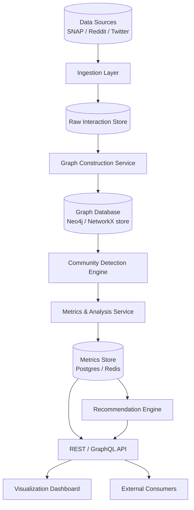
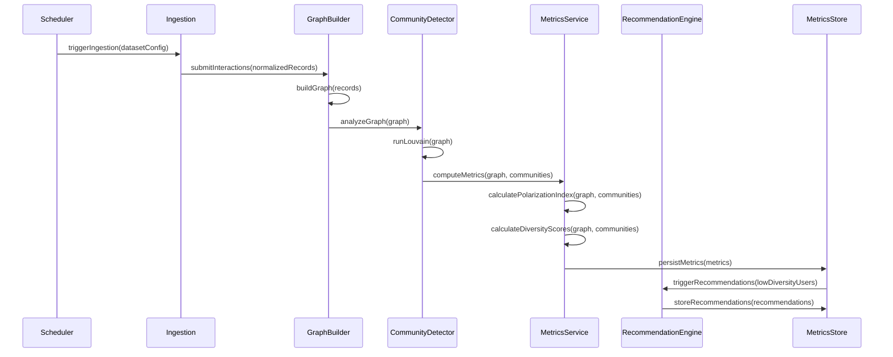
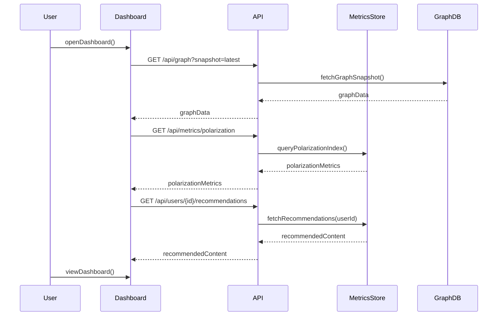

# Design Document: Echo Chamber Detector

## Overview

The Echo Chamber Detector is a data pipeline and analysis system that ingests social media interaction data, constructs interaction graphs, and applies community detection and polarization metrics to identify echo chambers — isolated clusters where users predominantly interact with ideologically similar peers. The system produces a Polarization Index, a Diversity Score per user and community, and a visualization dashboard, along with a recommendation engine that surfaces balanced viewpoints to users trapped in low-diversity clusters.

The system is dataset-agnostic: it operates on any interaction graph where nodes are users and edges represent interactions (retweets, replies, co-mentions, upvotes, etc.). Recommended public datasets include SNAP political retweet networks, Reddit Pushshift comment threads, and Twitter Academic API streams. The design separates ingestion, graph construction, analysis, and presentation into independent layers, allowing each to be scaled or swapped independently.

The core analytical pipeline runs in three stages: (1) graph construction from raw interaction logs, (2) community detection and polarization measurement, and (3) diversity scoring and recommendation generation. Results are persisted in a graph database and a metrics store, then served to a frontend dashboard.

---

## Architecture



### Layer Responsibilities

| Layer | Responsibility |
|---|---|
| Ingestion Layer | Fetch, normalize, and deduplicate raw interaction records from data sources |
| Graph Construction Service | Build weighted directed interaction graphs from normalized records |
| Community Detection Engine | Partition the graph into communities using modularity-based algorithms |
| Metrics & Analysis Service | Compute Polarization Index and Diversity Scores for communities and users |
| Recommendation Engine | Generate balanced content recommendations for low-diversity users |
| API Layer | Expose graph, metrics, and recommendations over REST/GraphQL |
| Visualization Dashboard | Interactive graph visualization, metric charts, and recommendation UI |

---

## Sequence Diagrams

### Main Analysis Pipeline



### Dashboard Query Flow



---

## Components and Interfaces

### Component 1: Ingestion Layer

**Purpose**: Fetch raw interaction records from data sources, normalize them into a canonical schema, deduplicate, and forward to the graph builder.

**Interface**:
```pascal
INTERFACE DataSourceAdapter
  PROCEDURE fetch(config: DatasetConfig): LIST OF RawRecord
  PROCEDURE normalize(raw: RawRecord): InteractionRecord
END INTERFACE

INTERFACE IngestionService
  PROCEDURE ingest(source: DataSourceAdapter, config: DatasetConfig): IngestionResult
  PROCEDURE getStatus(): IngestionStatus
END INTERFACE
```

**Responsibilities**:
- Support pluggable adapters for SNAP TSV files, Reddit Pushshift JSONL, Twitter API v2 JSON
- Enforce rate limits and backoff for live API sources
- Deduplicate by (sourceUserId, targetUserId, timestamp) composite key
- Emit normalized `InteractionRecord` objects to the graph builder queue

---

### Component 2: Graph Construction Service

**Purpose**: Transform a stream of interaction records into a weighted, directed graph where nodes are users and edge weights represent interaction frequency.

**Interface**:
```pascal
INTERFACE GraphConstructionService
  PROCEDURE buildGraph(records: LIST OF InteractionRecord): InteractionGraph
  PROCEDURE updateGraph(graph: InteractionGraph, newRecords: LIST OF InteractionRecord): InteractionGraph
  PROCEDURE persistGraph(graph: InteractionGraph, snapshotId: String): VOID
  PROCEDURE loadGraph(snapshotId: String): InteractionGraph
END INTERFACE
```

**Responsibilities**:
- Aggregate multi-edge interactions into a single weighted edge
- Support incremental graph updates (daily snapshots)
- Normalize edge weights to [0, 1] range
- Expose the graph to downstream consumers via serializable format (GraphML / adjacency list)

---

### Component 3: Community Detection Engine

**Purpose**: Partition the interaction graph into communities using modularity optimization (Louvain algorithm) and expose community membership for each user node.

**Interface**:
```pascal
INTERFACE CommunityDetectionEngine
  PROCEDURE detectCommunities(graph: InteractionGraph): CommunityPartition
  PROCEDURE getCommunityMembership(userId: String): CommunityId
  PROCEDURE computeModularity(graph: InteractionGraph, partition: CommunityPartition): FLOAT
END INTERFACE
```

**Responsibilities**:
- Run Louvain community detection (primary) and Girvan-Newman (secondary/validation)
- Assign every node a stable community ID across snapshots (label persistence)
- Compute modularity score Q as a quality metric for the partition
- Export community-to-member mappings

---

### Component 4: Metrics & Analysis Service

**Purpose**: Compute the Polarization Index for the full graph and per-community, and the Diversity Score for each user and community.

**Interface**:
```pascal
INTERFACE MetricsService
  PROCEDURE computePolarizationIndex(graph: InteractionGraph, partition: CommunityPartition): PolarizationMetrics
  PROCEDURE computeDiversityScore(userId: String, graph: InteractionGraph, partition: CommunityPartition): FLOAT
  PROCEDURE computeCommunityDiversityScore(communityId: CommunityId, graph: InteractionGraph): FLOAT
  PROCEDURE persistMetrics(metrics: AllMetrics): VOID
  PROCEDURE queryMetrics(filter: MetricsQuery): AllMetrics
END INTERFACE
```

**Responsibilities**:
- Polarization Index based on inter-community vs intra-community edge ratio
- Diversity Score based on fraction of a user's interactions that cross community boundaries
- Time-series storage of all metrics for trend analysis
- Expose metric deltas (change over time)

---

### Component 5: Recommendation Engine

**Purpose**: For users with low Diversity Scores, identify content or accounts from outside their community that are topically relevant and ideologically diverse.

**Interface**:
```pascal
INTERFACE RecommendationEngine
  PROCEDURE generateRecommendations(userId: String, graph: InteractionGraph, metrics: UserMetrics): LIST OF Recommendation
  PROCEDURE rankRecommendations(candidates: LIST OF Recommendation): LIST OF Recommendation
  PROCEDURE storeRecommendations(userId: String, recommendations: LIST OF Recommendation): VOID
  PROCEDURE fetchRecommendations(userId: String): LIST OF Recommendation
END INTERFACE
```

**Responsibilities**:
- Identify bridge nodes (high betweenness centrality across communities)
- Recommend accounts and content associated with bridge nodes
- Filter by topical relevance (shared hashtags/topics with user's history)
- Rank by diversity gain potential

---

### Component 6: API Layer

**Purpose**: Serve graph data, metrics, and recommendations to the dashboard and external consumers.

**Interface**:
```pascal
INTERFACE APILayer
  PROCEDURE getGraphSnapshot(snapshotId: String): GraphDTO
  PROCEDURE getPolarizationMetrics(snapshotId: String): PolarizationDTO
  PROCEDURE getUserMetrics(userId: String): UserMetricsDTO
  PROCEDURE getCommunityMetrics(communityId: String): CommunityMetricsDTO
  PROCEDURE getUserRecommendations(userId: String): LIST OF RecommendationDTO
END INTERFACE
```

**Responsibilities**:
- Paginate large graph responses
- Cache hot metrics queries in Redis
- Support filtering by date range, community, and metric threshold
- Rate-limit external API consumers

---

## Data Models

### InteractionRecord

```pascal
STRUCTURE InteractionRecord
  id:           String          // UUID, deduplicated
  sourceUserId: String          // Actor performing the interaction
  targetUserId: String          // Subject of the interaction
  interactionType: Enum         // RETWEET | REPLY | MENTION | UPVOTE | COMMENT
  timestamp:    DateTime
  contentId:    String          // Post/tweet/comment ID
  topicTags:    LIST OF String  // Hashtags or inferred topics
  datasetSource: String         // "twitter" | "reddit" | "snap"
END STRUCTURE
```

**Validation Rules**:
- `sourceUserId` and `targetUserId` must be non-empty and non-equal
- `timestamp` must be a valid past datetime
- `interactionType` must be a recognized enum value
- `id` must be globally unique

---

### InteractionGraph

```pascal
STRUCTURE Node
  userId:      String
  communityId: CommunityId      // Assigned after detection; null before
  betweenness: FLOAT            // Computed betweenness centrality
  diversityScore: FLOAT         // Computed diversity score
  topicVector: LIST OF FLOAT    // Embedding of user's topic interests
END STRUCTURE

STRUCTURE Edge
  sourceUserId: String
  targetUserId: String
  weight:       FLOAT           // Normalized interaction frequency [0, 1]
  isCrossCommunity: BOOLEAN     // Set after community detection
END STRUCTURE

STRUCTURE InteractionGraph
  nodes:     MAP OF String TO Node
  edges:     LIST OF Edge
  snapshotId: String
  createdAt: DateTime
  nodeCount: INTEGER
  edgeCount: INTEGER
END STRUCTURE
```

---

### CommunityPartition

```pascal
STRUCTURE CommunityPartition
  communityId:  CommunityId
  memberIds:    SET OF String
  modularity:   FLOAT           // Overall partition quality Q
  intraEdges:   INTEGER         // Edges within community
  interEdges:   INTEGER         // Edges crossing to other communities
  centroidNode: String          // Highest-degree node (hub)
END STRUCTURE
```

---

### PolarizationMetrics

```pascal
STRUCTURE PolarizationMetrics
  snapshotId:       String
  polarizationIndex: FLOAT      // [0, 1]; 1 = fully polarized
  modularity:       FLOAT       // Graph modularity Q
  communityCount:   INTEGER
  avgCommunitySize: FLOAT
  interCommunityEdgeRatio: FLOAT // inter / (intra + inter)
  computedAt:       DateTime
END STRUCTURE
```

---

### UserMetrics

```pascal
STRUCTURE UserMetrics
  userId:        String
  communityId:   CommunityId
  diversityScore: FLOAT         // [0, 1]; 1 = fully diverse
  intraEdgeCount: INTEGER
  interEdgeCount: INTEGER
  betweennessCentrality: FLOAT
  snapshotId:    String
  computedAt:    DateTime
END STRUCTURE
```

---

### Recommendation

```pascal
STRUCTURE Recommendation
  recommendationId: String
  targetUserId:     String
  recommendedUserId: String     // Account to follow
  contentId:        String      // Specific post/thread (optional)
  diversityGain:    FLOAT       // Predicted increase in diversity score
  topicRelevance:   FLOAT       // [0, 1] topic overlap score
  communityId:      CommunityId // Community the recommendation comes from
  reason:           String      // Human-readable explanation
END STRUCTURE
```

---

## Algorithmic Pseudocode

### Algorithm 1: Graph Construction

```pascal
ALGORITHM buildGraph(records)
  INPUT: records — LIST OF InteractionRecord
  OUTPUT: graph — InteractionGraph

  PRECONDITIONS:
    records IS NOT NULL AND records.size > 0
    ALL records have valid sourceUserId, targetUserId, timestamp

  POSTCONDITIONS:
    graph.nodes contains every unique userId appearing in records
    graph.edges contains one aggregated edge per (source, target) pair
    ALL edge weights are normalized to [0, 1]

  BEGIN
    edgeAccumulator ← empty MAP of (sourceId, targetId) TO INTEGER
    nodeSet ← empty SET

    FOR EACH record IN records DO
      nodeSet.add(record.sourceUserId)
      nodeSet.add(record.targetUserId)
      key ← (record.sourceUserId, record.targetUserId)
      edgeAccumulator[key] ← edgeAccumulator.getOrDefault(key, 0) + 1
    END FOR

    maxWeight ← MAX(edgeAccumulator.values())

    nodes ← empty MAP
    FOR EACH userId IN nodeSet DO
      nodes[userId] ← Node(userId, communityId=NULL, betweenness=0.0, diversityScore=0.0)
    END FOR

    edges ← empty LIST
    FOR EACH (key, rawWeight) IN edgeAccumulator DO
      normalizedWeight ← rawWeight / maxWeight
      edges.append(Edge(key.sourceId, key.targetId, normalizedWeight, isCrossCommunity=FALSE))
    END FOR

    RETURN InteractionGraph(nodes, edges, snapshotId=generateId(), createdAt=now())
  END
```

**Loop Invariants**:
- After each iteration of the accumulation loop: `edgeAccumulator` contains the correct raw count for all pairs processed so far
- After each iteration of the edge normalization loop: all emitted edges have weight ∈ [0, 1]

---

### Algorithm 2: Louvain Community Detection

```pascal
ALGORITHM runLouvain(graph)
  INPUT: graph — InteractionGraph
  OUTPUT: partition — MAP of userId TO CommunityId

  PRECONDITIONS:
    graph.nodes IS NOT EMPTY
    graph.edges IS NOT EMPTY
    ALL edge weights are in [0, 1]

  POSTCONDITIONS:
    EVERY node in graph.nodes is assigned exactly one communityId
    The resulting partition maximizes modularity Q
    Modularity Q >= 0

  BEGIN
    // Phase 1: Initialize — each node is its own community
    partition ← MAP where partition[userId] = userId FOR EACH userId IN graph.nodes

    improved ← TRUE

    WHILE improved DO
      improved ← FALSE

      FOR EACH node IN graph.nodes IN RANDOM ORDER DO
        currentCommunity ← partition[node.userId]
        bestCommunity ← currentCommunity
        bestDeltaQ ← 0.0

        neighbors ← graph.getNeighborCommunities(node.userId, partition)

        FOR EACH neighborCommunity IN neighbors DO
          deltaQ ← computeModularityGain(graph, node.userId, neighborCommunity, partition)

          IF deltaQ > bestDeltaQ THEN
            bestDeltaQ ← deltaQ
            bestCommunity ← neighborCommunity
          END IF
        END FOR

        IF bestCommunity ≠ currentCommunity THEN
          partition[node.userId] ← bestCommunity
          improved ← TRUE
        END IF
      END FOR
    END WHILE

    // Phase 2: Aggregate communities into super-nodes and repeat
    superGraph ← aggregateCommunities(graph, partition)

    IF superGraph.nodeCount < graph.nodeCount THEN
      superPartition ← runLouvain(superGraph)
      partition ← expandSuperPartition(partition, superPartition)
    END IF

    RETURN partition
  END
```

**Loop Invariants**:
- Outer WHILE loop: Modularity Q is non-decreasing after each full pass over all nodes
- Inner FOR EACH node loop: `bestDeltaQ` holds the maximum modularity gain seen so far among evaluated neighbor communities

---

### Algorithm 3: Polarization Index Calculation

```pascal
ALGORITHM computePolarizationIndex(graph, partition)
  INPUT:
    graph     — InteractionGraph
    partition — MAP of userId TO CommunityId
  OUTPUT: metrics — PolarizationMetrics

  PRECONDITIONS:
    graph IS NOT EMPTY
    partition assigns a communityId to every node
    ALL edge weights are in [0, 1]

  POSTCONDITIONS:
    metrics.polarizationIndex IS IN [0, 1]
    metrics.interCommunityEdgeRatio IS IN [0, 1]
    metrics.modularity IS IN [-0.5, 1]

  BEGIN
    intraEdgeWeight ← 0.0
    interEdgeWeight ← 0.0

    FOR EACH edge IN graph.edges DO
      IF partition[edge.sourceUserId] = partition[edge.targetUserId] THEN
        intraEdgeWeight ← intraEdgeWeight + edge.weight
        edge.isCrossCommunity ← FALSE
      ELSE
        interEdgeWeight ← interEdgeWeight + edge.weight
        edge.isCrossCommunity ← TRUE
      END IF
    END FOR

    totalWeight ← intraEdgeWeight + interEdgeWeight

    IF totalWeight = 0 THEN
      RETURN PolarizationMetrics(polarizationIndex=0.0, interCommunityEdgeRatio=0.0)
    END IF

    interRatio ← interEdgeWeight / totalWeight
    // polarizationIndex: high intra, low inter = high polarization
    polarizationIndex ← 1.0 - interRatio

    modularity ← computeModularity(graph, partition)
    communityCount ← COUNT(DISTINCT values IN partition)

    RETURN PolarizationMetrics(
      polarizationIndex    = polarizationIndex,
      modularity           = modularity,
      interCommunityEdgeRatio = interRatio,
      communityCount       = communityCount,
      computedAt           = now()
    )
  END
```

**Loop Invariants**:
- After each edge iteration: `intraEdgeWeight + interEdgeWeight` equals the sum of weights of all edges processed so far

---

### Algorithm 4: Diversity Score Calculation (Per User)

```pascal
ALGORITHM computeDiversityScore(userId, graph, partition)
  INPUT:
    userId    — String
    graph     — InteractionGraph
    partition — MAP of userId TO CommunityId
  OUTPUT: score — FLOAT in [0, 1]

  PRECONDITIONS:
    userId IS IN graph.nodes
    partition[userId] IS NOT NULL

  POSTCONDITIONS:
    score IS IN [0, 1]
    score = 1.0 IF AND ONLY IF all interactions are cross-community
    score = 0.0 IF AND ONLY IF all interactions are intra-community

  BEGIN
    userCommunity ← partition[userId]
    outgoingEdges ← graph.getOutgoingEdges(userId)

    IF outgoingEdges IS EMPTY THEN
      RETURN 0.0
    END IF

    crossCommunityWeight ← 0.0
    totalWeight ← 0.0

    FOR EACH edge IN outgoingEdges DO
      totalWeight ← totalWeight + edge.weight

      IF partition[edge.targetUserId] ≠ userCommunity THEN
        crossCommunityWeight ← crossCommunityWeight + edge.weight
      END IF
    END FOR

    IF totalWeight = 0 THEN
      RETURN 0.0
    END IF

    RETURN crossCommunityWeight / totalWeight
  END
```

**Loop Invariants**:
- After each iteration: `crossCommunityWeight <= totalWeight`
- The ratio `crossCommunityWeight / totalWeight` is well-defined and in [0, 1] upon loop completion

---

### Algorithm 5: Betweenness Centrality (Bridge Node Detection)

```pascal
ALGORITHM computeBetweennessCentrality(graph)
  INPUT: graph — InteractionGraph
  OUTPUT: centrality — MAP of userId TO FLOAT

  PRECONDITIONS:
    graph IS NOT EMPTY

  POSTCONDITIONS:
    ALL centrality values are non-negative
    Values are normalized to [0, 1]

  // Brandes' algorithm (O(VE) for unweighted, O(VE + V^2 log V) for weighted)
  BEGIN
    centrality ← MAP with all userId keys initialized to 0.0

    FOR EACH source IN graph.nodes DO
      stack ← empty STACK
      predecessors ← MAP of userId TO empty LIST
      sigma ← MAP of userId TO 0 (sigma[source] = 1)
      dist ← MAP of userId TO -1 (dist[source] = 0)
      queue ← QUEUE containing source

      // BFS to compute shortest path counts
      WHILE queue IS NOT EMPTY DO
        v ← queue.dequeue()
        stack.push(v)

        FOR EACH neighbor w OF v IN graph DO
          IF dist[w] < 0 THEN
            queue.enqueue(w)
            dist[w] ← dist[v] + 1
          END IF

          IF dist[w] = dist[v] + 1 THEN
            sigma[w] ← sigma[w] + sigma[v]
            predecessors[w].append(v)
          END IF
        END FOR
      END WHILE

      // Backpropagate dependency scores
      delta ← MAP of userId TO 0.0

      WHILE stack IS NOT EMPTY DO
        w ← stack.pop()

        FOR EACH v IN predecessors[w] DO
          delta[v] ← delta[v] + (sigma[v] / sigma[w]) * (1.0 + delta[w])
        END FOR

        IF w ≠ source THEN
          centrality[w] ← centrality[w] + delta[w]
        END IF
      END WHILE
    END FOR

    // Normalize
    n ← graph.nodeCount
    normFactor ← (n - 1) * (n - 2)

    IF normFactor > 0 THEN
      FOR EACH userId IN centrality DO
        centrality[userId] ← centrality[userId] / normFactor
      END FOR
    END IF

    RETURN centrality
  END
```

**Loop Invariants**:
- During BFS: `dist[v]` contains the shortest-path distance from source to v for all dequeued nodes
- During backpropagation: `delta[w]` accumulates the correct dependency score for w with respect to the source

---

### Algorithm 6: Recommendation Generation

```pascal
ALGORITHM generateRecommendations(userId, graph, metrics, topK)
  INPUT:
    userId  — String
    graph   — InteractionGraph
    metrics — UserMetrics
    topK    — INTEGER (number of recommendations to return)
  OUTPUT: recommendations — LIST OF Recommendation, length <= topK

  PRECONDITIONS:
    userId IS IN graph.nodes
    metrics.diversityScore IS IN [0, 1]
    topK > 0

  POSTCONDITIONS:
    recommendations.size <= topK
    ALL recommendations are from communities different from metrics.communityId
    ALL recommendations are sorted descending by diversityGain

  BEGIN
    userCommunity ← metrics.communityId
    userTopics ← graph.nodes[userId].topicVector

    // Step 1: Gather bridge node candidates
    bridgeCandidates ← empty LIST

    FOR EACH node IN graph.nodes DO
      IF node.communityId ≠ userCommunity THEN
        IF node.betweenness > BRIDGE_CENTRALITY_THRESHOLD THEN
          bridgeCandidates.append(node)
        END IF
      END IF
    END FOR

    // Step 2: Score each candidate
    scoredCandidates ← empty LIST

    FOR EACH candidate IN bridgeCandidates DO
      topicSimilarity ← cosineSimilarity(userTopics, candidate.topicVector)

      IF topicSimilarity >= MIN_TOPIC_RELEVANCE_THRESHOLD THEN
        diversityGain ← estimateDiversityGain(userId, candidate.userId, graph, metrics)

        scoredCandidates.append(ScoredCandidate(
          userId         = candidate.userId,
          topicRelevance = topicSimilarity,
          diversityGain  = diversityGain
        ))
      END IF
    END FOR

    // Step 3: Rank by diversityGain descending
    scoredCandidates ← sortDescendingBy(scoredCandidates, field=diversityGain)

    // Step 4: Build recommendation objects
    recommendations ← empty LIST

    FOR EACH candidate IN scoredCandidates[0 .. topK - 1] DO
      rec ← Recommendation(
        recommendationId  = generateId(),
        targetUserId      = userId,
        recommendedUserId = candidate.userId,
        diversityGain     = candidate.diversityGain,
        topicRelevance    = candidate.topicRelevance,
        communityId       = graph.nodes[candidate.userId].communityId,
        reason            = buildReasonString(candidate, userCommunity)
      )
      recommendations.append(rec)
    END FOR

    RETURN recommendations
  END
```

**Loop Invariants**:
- Bridge candidate loop: `bridgeCandidates` contains only nodes from communities other than `userCommunity`
- Scoring loop: `scoredCandidates` contains only candidates with `topicRelevance >= MIN_TOPIC_RELEVANCE_THRESHOLD`

---

## Key Functions with Formal Specifications

### computeModularityGain()

```pascal
PROCEDURE computeModularityGain(graph, nodeId, targetCommunity, partition)
  INPUT:
    graph           — InteractionGraph
    nodeId          — String
    targetCommunity — CommunityId
    partition       — MAP of userId TO CommunityId
  OUTPUT: deltaQ — FLOAT
```

**Preconditions**:
- `nodeId` is present in `graph.nodes`
- `targetCommunity` is a valid community in `partition`
- `partition[nodeId]` is currently set (can be same as targetCommunity)

**Postconditions**:
- Returns the change in modularity Q if `nodeId` were moved to `targetCommunity`
- Returns 0.0 if `targetCommunity` equals current community of `nodeId`
- Negative return means the move would reduce modularity

**Loop Invariants**: N/A (single-pass calculation)

---

### estimateDiversityGain()

```pascal
PROCEDURE estimateDiversityGain(userId, candidateId, graph, metrics)
  INPUT:
    userId      — String
    candidateId — String
    graph       — InteractionGraph
    metrics     — UserMetrics
  OUTPUT: gain — FLOAT in [0, 1]
```

**Preconditions**:
- Both `userId` and `candidateId` are present in `graph.nodes`
- `metrics.diversityScore` is a valid precomputed score in [0, 1]

**Postconditions**:
- Returns an estimated improvement in `userId`'s diversity score if an edge to `candidateId` were added
- Returns 0.0 if `candidateId` is in the same community as `userId`
- Returns a value in [0, 1 - metrics.diversityScore]

---

### cosineSimilarity()

```pascal
PROCEDURE cosineSimilarity(vectorA, vectorB)
  INPUT:
    vectorA — LIST OF FLOAT
    vectorB — LIST OF FLOAT
  OUTPUT: similarity — FLOAT in [-1, 1]
```

**Preconditions**:
- `vectorA.size = vectorB.size`
- Neither vector is the zero vector (if either is zero, return 0.0)

**Postconditions**:
- Returns dot product of vectorA and vectorB divided by the product of their magnitudes
- Returns value in [-1, 1]; for topic vectors (non-negative), result is in [0, 1]

**Loop Invariants**:
- Dot product accumulation: partial sum equals the sum of products of all pairs processed so far

---

## Example Usage

```pascal
// === Full Pipeline Example ===

SEQUENCE
  // 1. Ingest data from SNAP political retweet dataset
  config ← DatasetConfig(source="snap", path="/data/polblogs.txt", format="edge-list")
  records ← ingestionService.ingest(SNAPAdapter, config)

  // 2. Build interaction graph
  graph ← graphBuilder.buildGraph(records)
  // graph.nodeCount ≈ 1490, graph.edgeCount ≈ 19090 (polblogs dataset)

  // 3. Detect communities
  partition ← communityDetector.detectCommunities(graph)
  // Expected: 2 major communities (liberal, conservative blogs)

  // 4. Compute global polarization metrics
  polarizationMetrics ← metricsService.computePolarizationIndex(graph, partition)
  // polarizationMetrics.polarizationIndex ≈ 0.85 for polblogs
  // polarizationMetrics.modularity ≈ 0.43

  // 5. Compute per-user diversity scores
  FOR EACH userId IN graph.nodes DO
    score ← metricsService.computeDiversityScore(userId, graph, partition)
    graph.nodes[userId].diversityScore ← score
  END FOR

  // 6. Identify low-diversity users and generate recommendations
  lowDiversityUsers ← graph.nodes.filter(node → node.diversityScore < 0.2)

  FOR EACH user IN lowDiversityUsers DO
    recommendations ← recommendationEngine.generateRecommendations(user.userId, graph, metricsForUser(user), topK=5)
    recommendationEngine.storeRecommendations(user.userId, recommendations)
  END FOR

  // 7. Serve to dashboard
  api.getGraphSnapshot(graph.snapshotId)         // → GraphDTO for visualization
  api.getPolarizationMetrics(graph.snapshotId)   // → PolarizationDTO for charts
  api.getUserRecommendations("user_42")           // → LIST OF RecommendationDTO
END SEQUENCE
```

```pascal
// === Incremental Update Example ===

SEQUENCE
  existingGraph ← graphBuilder.loadGraph(snapshotId="2024-01-15")
  newRecords    ← ingestionService.ingest(TwitterAdapter, last24hConfig)

  updatedGraph  ← graphBuilder.updateGraph(existingGraph, newRecords)
  partition     ← communityDetector.detectCommunities(updatedGraph)
  metrics       ← metricsService.computePolarizationIndex(updatedGraph, partition)

  metricsService.persistMetrics(metrics)
END SEQUENCE
```

---

## Correctness Properties

*A property is a characteristic or behavior that should hold true across all valid executions of a system — essentially, a formal statement about what the system should do. Properties serve as the bridge between human-readable specifications and machine-verifiable correctness guarantees.*

### Property 1: Graph Construction — Node Coverage

*For any* non-empty list of InteractionRecords, every userId that appears as a sourceUserId or targetUserId in any record must be present as a node in the resulting InteractionGraph, and the graph must contain exactly one directed edge per unique (sourceUserId, targetUserId) pair with an edge weight in [0, 1].

**Validates: Requirements 2.1, 2.2, 2.3**

---

### Property 2: Graph Construction — Idempotence

*For any* list of InteractionRecords, calling buildGraph on the same list twice must produce equivalent InteractionGraphs (same node set, same edge set, same edge weights).

**Validates: Requirements 2.5**

---

### Property 3: Graph Construction — Incremental Equivalence

*For any* existing InteractionGraph G and a list of new InteractionRecords R, the result of updateGraph(G, R) must be equivalent to buildGraph(original_records ∪ R), where original_records are the records used to construct G.

**Validates: Requirements 2.7**

---

### Property 4: Graph Serialization Round-Trip

*For any* valid InteractionGraph, serializing it to a Snapshot and then deserializing that Snapshot must produce an InteractionGraph with an identical node set, edge set, and edge weights (lossless round-trip).

**Validates: Requirements 11.2, 11.3**

---

### Property 5: Input Validation — Rejection of Invalid Records

*For any* InteractionRecord where sourceUserId is empty, targetUserId is empty, sourceUserId equals targetUserId, interactionType is not a recognized enum value, or timestamp is not a valid past datetime, the Ingestion_Layer must reject that record and must not include it in the normalized output.

**Validates: Requirements 1.3, 2.4, 9.1, 9.2, 9.3, 9.4**

---

### Property 6: Normalization Completeness

*For any* valid raw record successfully accepted by the Ingestion_Layer, the resulting InteractionRecord must have all required fields populated: id, sourceUserId, targetUserId, interactionType, timestamp, contentId, topicTags, and datasetSource.

**Validates: Requirements 1.2**

---

### Property 7: Ingestion Deduplication

*For any* ingestion batch containing duplicate records sharing the same composite key (sourceUserId, targetUserId, timestamp), the normalized output must contain exactly one record per unique composite key (no duplicates).

**Validates: Requirements 1.3**

---

### Property 8: Community Coverage — Every Node Assigned

*For any* non-empty InteractionGraph, every node in the graph must be assigned exactly one CommunityId in the resulting CommunityPartition (no node is unassigned, no node is assigned to more than one community).

**Validates: Requirements 3.1**

---

### Property 9: Modularity Non-Negativity

*For any* CommunityPartition produced by the Community_Detector, the modularity score Q must be non-negative (Q ≥ 0).

**Validates: Requirements 3.4**

---

### Property 10: Polarization Index — Range Invariant

*For any* InteractionGraph G and CommunityPartition P, the computed PolarizationIndex must be in the range [0, 1].

**Validates: Requirements 4.1**

---

### Property 11: Polarization Index — Complementarity Identity

*For any* InteractionGraph G and CommunityPartition P, the sum of PolarizationIndex and interCommunityEdgeRatio must equal exactly 1.0 (PolarizationIndex + interCommunityEdgeRatio = 1.0).

**Validates: Requirements 4.4**

---

### Property 12: Polarization Index — Boundary Conditions

*For any* InteractionGraph where all edges are intra-community, the PolarizationIndex must equal 1.0; and *for any* InteractionGraph where all edges are inter-community, the PolarizationIndex must equal 0.0.

**Validates: Requirements 4.2, 4.3**

---

### Property 13: Diversity Score — Range Invariant

*For any* user u in an InteractionGraph G with CommunityPartition P, the computed DiversityScore must be in the range [0, 1].

**Validates: Requirements 5.1**

---

### Property 14: Diversity Score — Boundary Conditions

*For any* user whose outgoing interactions are all intra-community, the DiversityScore must equal 0.0; *for any* user whose outgoing interactions are all inter-community, the DiversityScore must equal 1.0; and *for any* user with no outgoing edges, the DiversityScore must equal 0.0.

**Validates: Requirements 5.2, 5.3, 5.4**

---

### Property 15: Community Diversity Score — Averaging Invariant

*For any* community C in a CommunityPartition, the community-level DiversityScore must equal the arithmetic mean of the DiversityScores of all member users of C.

**Validates: Requirements 5.5**

---

### Property 16: Betweenness Centrality — Range Invariant

*For any* InteractionGraph, all computed betweenness centrality values must be non-negative and normalized to the range [0, 1].

**Validates: Requirements 5.6**

---

### Property 17: Recommendations — Cross-Community Invariant

*For any* user u and *for any* recommendation generated for u, the recommendedUserId must belong to a community different from u's community.

**Validates: Requirements 6.1**

---

### Property 18: Recommendations — Candidate Quality Invariant

*For any* recommendation generated by the Recommendation_Engine, the recommended account must have a betweenness centrality above the configured bridge threshold, and the topicRelevance score between the user and the recommended account must be at or above the configured minimum topic relevance threshold.

**Validates: Requirements 6.2, 6.3**

---

### Property 19: Recommendations — Sorted by Diversity Gain

*For any* list of recommendations returned for a user, the list must be sorted in non-increasing order of diversityGain (first recommendation has the highest or equal diversityGain).

**Validates: Requirements 6.4**

---

### Property 20: Recommendations — Size Bound

*For any* call to generateRecommendations with parameter topK, the returned list must have length at most topK.

**Validates: Requirements 6.5**

---

## Error Handling

### Error Scenario 1: Empty Dataset / No Interactions

**Condition**: Ingestion returns zero valid records (empty file, all records filtered as duplicates, API returns no results).
**Response**: `buildGraph` returns an empty `InteractionGraph`; downstream components short-circuit and return default zero-metric results.
**Recovery**: Log warning with dataset config; scheduler retries after configurable backoff; alert if empty dataset persists for N consecutive runs.

---

### Error Scenario 2: Disconnected Graph (Single Isolated Node)

**Condition**: A user node has no edges after construction (inactive account or isolated within the ingestion window).
**Response**: `computeDiversityScore` returns 0.0 (handled by the empty-edges check in the algorithm). Community detection assigns isolated nodes to singleton communities.
**Recovery**: Isolated nodes are excluded from recommendation targets (no outgoing edges means no valid diversity gain estimate).

---

### Error Scenario 3: Community Detection Fails to Converge

**Condition**: Louvain's modularity improvement loop runs indefinitely (oscillating partition).
**Response**: Enforce a `MAX_ITERATIONS` cap (default: 100 passes). Accept the best partition found so far.
**Recovery**: Log the modularity score at termination; flag the snapshot as "approximate partition" in metadata; fall back to Girvan-Newman for validation.

---

### Error Scenario 4: Data Source Unavailable (API Rate Limit / Network Failure)

**Condition**: Twitter API or Reddit Pushshift returns HTTP 429 or connection timeout.
**Response**: Ingestion adapter catches the error, enters exponential backoff (1s, 2s, 4s … up to 5 retries), then marks the job as failed.
**Recovery**: Scheduler retries the ingestion job in the next scheduled window; the previous snapshot remains active in the dashboard.

---

### Error Scenario 5: Topic Vector Missing for New User

**Condition**: A new user has no interaction history, so no topic vector can be constructed.
**Response**: `generateRecommendations` falls back to using the community centroid's topic vector as a proxy.
**Recovery**: Once the user accumulates N >= 5 interactions, a personalized topic vector is computed and cached.

---

## Testing Strategy

### Unit Testing Approach

Test each algorithm in isolation with small, hand-crafted graphs where ground truth is known.

Key test cases:
- **buildGraph**: Two records with same (source, target) → single edge with weight = 1.0 after normalization
- **runLouvain**: Complete bipartite graph K(5,5) → two communities of size 5 each
- **computePolarizationIndex**: Graph with all intra-community edges → index = 1.0
- **computePolarizationIndex**: Graph with all inter-community edges → index = 0.0
- **computeDiversityScore**: User with no outgoing edges → score = 0.0
- **generateRecommendations**: User in fully isolated community → recommendations all from other communities

### Property-Based Testing Approach

**Property Test Library**: fast-check (JavaScript) or Hypothesis (Python)

Properties to test:
- `∀ valid graph G, partition P: polarizationIndex(G, P) ∈ [0, 1]`
- `∀ user u in G: diversityScore(u, G, P) ∈ [0, 1]`
- `∀ edge list: buildGraph is idempotent` (applying build twice on same records yields the same graph)
- `∀ G: sum(intraEdgeWeights) + sum(interEdgeWeights) = sum(allEdgeWeights)` after polarization computation
- `∀ recommendation r for user u: communityOf(r.recommendedUserId) ≠ communityOf(u)`

### Integration Testing Approach

- Load the SNAP polblogs dataset (1,490 nodes, 19,090 edges) and verify:
  - Louvain detects exactly 2 major communities
  - Polarization Index > 0.80 (consistent with published research on polblogs)
  - < 5% of nodes have diversityScore > 0.5 (highly polarized dataset)
- Load a synthetic balanced graph (equal intra/inter edges) and verify:
  - Polarization Index ≈ 0.5
  - Average diversityScore ≈ 0.5
- End-to-end API test: ingest → build → detect → metrics → recommendations → API response

---

## Performance Considerations

- **Graph Scale**: Design targets graphs up to ~1M nodes and ~10M edges (Twitter mid-scale dataset). For larger graphs, use distributed graph processing (Apache Spark GraphX or GraphFrames).
- **Louvain Complexity**: O(n log n) in practice for sparse graphs. For graphs > 500K nodes, run on a dedicated compute node or partition the graph by time window.
- **Betweenness Centrality**: O(VE) — expensive for large graphs. Use approximate betweenness (random-sample BFS, Brandes with k-sources) for graphs > 100K nodes.
- **Incremental Updates**: Prefer incremental graph updates over full rebuilds. Only recompute community detection and metrics for subgraphs affected by new edges.
- **Caching**: Cache metric query results in Redis with a TTL matching the ingestion cadence (e.g., 24h for daily snapshots).
- **Topic Vectors**: Precompute and cache user topic vectors; update lazily when a user accumulates N new interactions.

---

## Security Considerations

- **Data Anonymization**: Strip or hash PII (real usernames, email addresses) before storing in the graph database. Use internal UUIDs as node identifiers.
- **Dataset Compliance**: SNAP datasets are public domain. Reddit Pushshift and Twitter Academic API data must be used in compliance with their respective Terms of Service; do not redistribute raw tweet/post content.
- **API Authentication**: All API endpoints require authentication (JWT or API key). Recommendation endpoints enforce per-user access control (users can only fetch their own recommendations).
- **Rate Limiting**: Enforce rate limits on the ingestion adapters (respect upstream API limits) and on the outbound REST API.
- **Input Validation**: Validate all graph inputs (no self-loops, no negative weights) before processing to prevent algorithmic instability.

---

## Recommended Datasets

| Dataset | Source | Nodes | Edges | Notes |
|---|---|---|---|---|
| Political Blogs (polblogs) | SNAP | 1,490 | 19,090 | Classic echo chamber benchmark; 2 communities (liberal/conservative) |
| Political Retweet Network | SNAP | 18,470 | 48,053 | Twitter retweets around 2010 US elections |
| Reddit Comment Graph | Pushshift / Academic Torrents | Variable | Variable | Filter by subreddit; ideal for topic-specific analysis |
| Twitter Filter Bubble Dataset | Twitter Academic API | Variable | Variable | Requires approved API access |
| DBLP Co-authorship | SNAP | 317,080 | 1,049,866 | Useful for large-scale algorithm validation (non-political) |

**Recommended starting point**: SNAP polblogs (`http://snap.stanford.edu/data/political-blogs.html`) — small enough for rapid development, well-studied, and has known ground-truth community labels.

---

## Dependencies

| Dependency | Purpose |
|---|---|
| NetworkX (Python) | In-memory graph construction, Louvain, centrality algorithms |
| python-louvain / community | Louvain community detection |
| scikit-learn | Cosine similarity, topic vectorization (TF-IDF) |
| Neo4j | Persistent graph database — always-on mirror of the NetworkX graph for querying and visualization |
| Redis | Metrics caching and recommendation cache |
| PostgreSQL | Time-series metrics storage |
| D3.js / Sigma.js | Interactive graph visualization on dashboard |
| fast-check / Hypothesis | Property-based testing |
| FastAPI / Express | REST API layer |
| Apache Spark GraphX | Large-scale distributed graph processing (> 1M nodes) |
